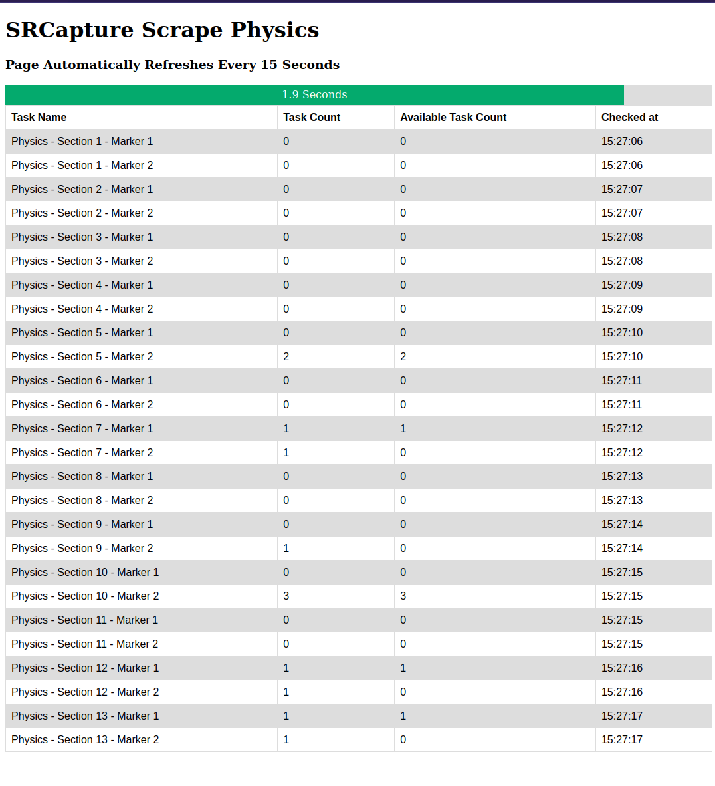

# SRCapture-task-bot
List all the tasks remaining to do on a single statically generated webpage

SRCapure is a web-based service which enables exam papers to be marked by multiple markers at once.
It was used over the pandemic to mark the Physics Aptitude Test at The University of Oxford, which applies to both prospective Physics and Engineering undergraduates.

This scraper bot was made in approximately half an hour to enable supervisors of the markers to quickly see what is going on.
If I were to redo this, I'd have a page which dynamically updates with AJAX rather than refreshes every 15 seconds.

This bot iterates over all questions on a SRCapture marking page, highlighting how many papers are left to mark.
This is then compiled into a static HTML file, and uploaded to server where the results can be seen.
When written, this functionality did not exist in SRCapture, so it might help with users trying to organise a hoarde of markers in the future.

## Requirements:
- Python3:
  - selenium
  - all other modules should be built in
- Firefox
- Linux / MacOS
- A server you can SSH into, and host html files.

## Example Output:

